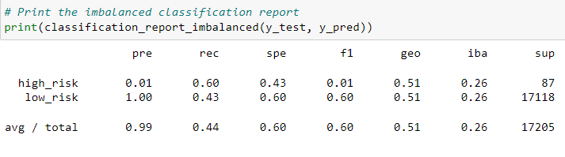

# Credit_Risk_Analysis
## Background
Jill commends you for all your hard work. Piece by piece, you’ve been building up your skills in data preparation, statistical reasoning, and machine learning. You are now ready to apply machine learning to solve a real-world challenge: credit card risk.

## Overview of the analysis
Credit risk is an inherently unbalanced classification problem, as good loans easily outnumber risky loans. Employ different techniques to train and evaluate models with unbalanced classes. Jill asks you to use imbalanced-learn and scikit-learn libraries to build and evaluate models using resampling.

Using the credit card credit dataset from LendingClub, a peer-to-peer lending services company, oversample the data using RandomOverSampler and SMOTE algorithms, and undersample the data using the ClusterCentroids algorithm. Then, use a combinatorial approach of over- and undersampling using the SMOTEENN algorithm. Next, compared two new machine learning models that reduce bias, BalancedRandomForestClassifier and EasyEnsembleClassifier, to predict credit risk. Evaluate the performance of these models and make a written recommendation on whether they should be used to predict credit risk.

## Results

### Naive Random Oversampling

* balanced accuracy score - 0.6293939430565123
* precision - 0.99
* recall scores - 0.68

### SMOTE Oversampling

* balanced accuracy score - 0.6277008271188627
* precision - 0.99
* recall scores - 0.63

### Undersampling

* balanced accuracy score - 0.5160488455386748
* precision - 0.99
* recall scores - 0.44

### Combination (Over and Under) Sampling
%20Sampling.png)

* balanced accuracy score - 0.6547574442712047
* precision - 0.99
* recall scores - 0.61

### Balanced Random Forest Classifier

* balanced accuracy score - 0.7877672625306695
* precision - 0.61
* recall scores - 0.91

### Easy Ensemble AdaBoost Classifier

* balanced accuracy score - 0.925427358175101
* precision - 0.99
* recall scores - 0.94

## Summary: Summarize the results of the machine learning models, and include a recommendation on the model to use, if any. If you do not recommend any of the models, justify your reasoning.
1. Majority of the learning models produced a result below 80% accuracy. Undersampling displayed a accuracy score of 52% resulting in the worst model to use in credit risk analysis. Now the best producing accuracy score came from Easy Ensemble Adaboost with a 92% accuracy score. 

2. Five out of the  models produced an precision of 99%. Making most of the models reliable to use however it is not recommended to use Balance Random Forest since it only produced an precision of 61%

3. Two out of six modules pulled a recall score above 90% (Balanced Random Forest Classifier, Easy Ensemble AdaBoost Classifier). Even though Balanced Random Forest Classifier has a recall of 91% the precision makes it unreliabe to use. 

4. If I was to recommend any model it would be Easy Ensemble AdaBoost Classifier. It out performed the other models in accuracy, precision, and recall scores.  